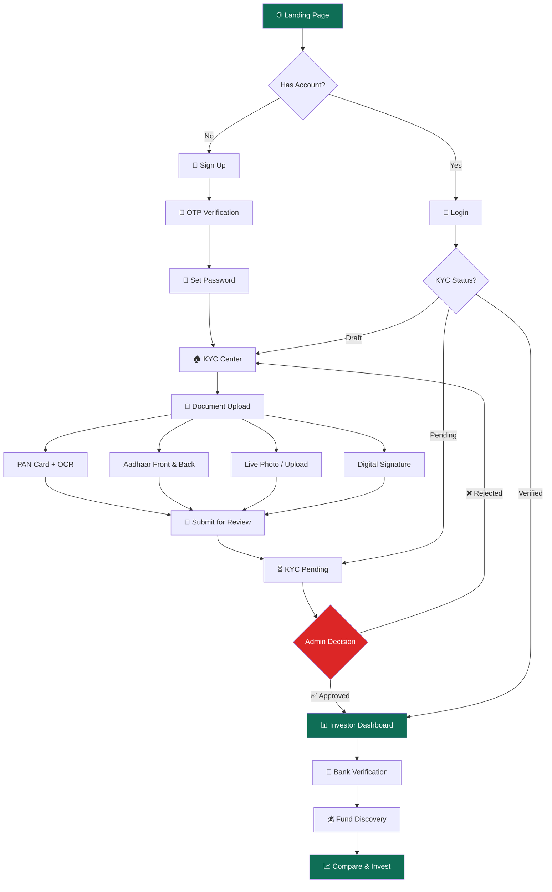
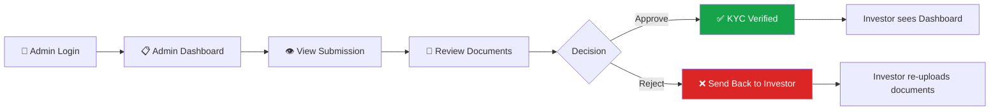

<div align="center">

# 💧 FundFirst — Investor Onboarding & KYC Platform

**A premium, production-grade React application for seamless mutual fund investor onboarding with real-time KYC verification, admin review workflows, and fund discovery.**

[](https://react.dev/)
[](https://vitejs.dev/)
[](https://tailwindcss.com/)
[](LICENSE)

---


</div>

---

## 📖 Table of Contents

- [Overview](#-overview)
- [Key Features](#-key-features)
- [Tech Stack](#-tech-stack)
- [Architecture](#-architecture)
- [Project Structure](#-project-structure)
- [User Flow](#-user-flow)
- [Getting Started](#-getting-started)
- [Environment Setup](#-environment-setup)
- [Available Scripts](#-available-scripts)
- [Route Map](#-route-map)
- [State Management](#-state-management)
- [Admin Panel](#-admin-panel)
- [Screenshots](#-screenshots)
- [Roadmap](#-roadmap)
- [Contributing](#-contributing)
- [Code of Conduct](#-code-of-conduct)
- [License](#-license)

---

## 🌟 Overview

**FundFirst** is a fully functional, single-page investor onboarding and KYC (Know Your Customer) verification platform built for the Indian mutual fund ecosystem. It simulates the complete journey an investor takes — from discovering the platform, to signing up, completing document verification (PAN, Aadhaar, Photo, Signature), receiving admin approval, linking a bank account, and finally discovering & comparing mutual funds.

The platform features two distinct portals:
- **Investor Portal** — A premium, dark-mode-first dashboard experience for retail investors
- **Admin Panel** — A review dashboard for compliance officers to approve/reject KYC submissions

> **Note:** This is a frontend-only application. All data is persisted via `localStorage` and can be extended with a backend API in Phase 2.

---

## ✨ Key Features

### 🔐 Authentication & Onboarding
- Multi-step sign-up flow with OTP verification
- Secure login with password visibility toggle
- Password setup with strength validation
- Route guards (Public, Protected, KYC, Dashboard, Admin)
- Session persistence via localStorage

### 📄 KYC Document Verification
- **PAN Card** — Upload or capture via webcam with **real OCR** powered by Tesseract.js
  - Extracts PAN number, holder name, and date of birth automatically
  - Validates PAN format with regex (`ABCDE1234F`)
- **Aadhaar Card** — Front and back upload with masked number display
- **Live Photo** — Webcam capture or manual file upload
- **Digital Signature** — Canvas-based signature pad with clear/redo functionality
- Automatic KYC status progression: `draft → pending → verified/rejected`

### 🏦 Bank Verification
- Dynamic form with account holder name auto-populated from KYC
- Account number with confirmation matching
- IFSC code verification with branch detail lookup
- Bank document upload (passbook/cheque leaf)
- State synchronization with main dashboard

### 📊 Investor Dashboard
- Real-time progress tracker (5-step onboarding pipeline)
- Dynamic action cards that respond to current KYC & bank status
- Animated progress ring with percentage completion
- Context-aware "Next Step" banner
- Recent activity feed with notification previews

### 💰 Fund Discovery & Comparison
- 8 curated mutual fund cards with real-world data
- Category filters (Equity, Debt, Hybrid, ELSS, Index Funds)
- Full-text search across fund names and categories
- Side-by-side comparison drawer (up to 3 funds)
- Risk meter visualization per fund
- Favorite/wishlist functionality
- Minimizable comparison tray with floating action button

### 🛡️ Admin Panel
- Separate login flow (`admin / admin123`)
- KYC submission review with uploaded document viewer
- One-click Approve / Reject workflow
- Real-time state synchronization with investor portal
- Document preview in modal overlays

### 🎨 Design & UX
- Material Design 3 (M3) color system with CSS custom properties
- Dark mode by default with light mode support via `ThemeContext`
- Glassmorphism panels with blur effects
- Smooth page transitions and micro-animations
- Fully responsive (mobile, tablet, desktop)
- Google Fonts: Inter, Outfit, JetBrains Mono
- Material Symbols icon system

---

## 🛠️ Tech Stack

| Layer | Technology | Version | Purpose |
|-------|-----------|---------|---------|
| **Runtime** | React | 19.2.7 | UI component framework |
| **Bundler** | Vite | 8.1.0 | Build tool & dev server |
| **Styling** | Tailwind CSS | 4.3.1 | Utility-first CSS framework |
| **Routing** | React Router DOM | 7.18.0 | Client-side routing |
| **Animation** | Framer Motion | 12.41.0 | Page transitions & animations |
| **OCR** | Tesseract.js | 7.0.0 | PAN card text extraction |
| **Linting** | OxLint | 1.69.0 | Fast JavaScript linter |

---

## 🏗️ Architecture

### High-Level Architecture Diagram

```
┌─────────────────────────────────────────────────────────────┐
│                        BROWSER                               │
│  ┌───────────────────────────────────────────────────────┐   │
│  │                    React 19 SPA                        │   │
│  │  ┌─────────────┐  ┌──────────┐  ┌──────────────────┐  │   │
│  │  │  Contexts    │  │  Router   │  │  Layouts          │  │   │
│  │  │ ┌─────────┐  │  │ (Guards)  │  │ ┌──────────────┐ │  │   │
│  │  │ │AuthCtx  │  │  │          │  │ │MarketingLayout│ │  │   │
│  │  │ │ThemeCtx │  │  │ Public   │  │ │DashboardLayout│ │  │   │
│  │  │ └─────────┘  │  │ Protected│  │ │AdminLayout    │ │  │   │
│  │  └──────┬───────┘  │ KYC      │  │ └──────────────┘ │  │   │
│  │         │          │ Dashboard│  └────────┬─────────┘  │   │
│  │         │          │ Admin    │           │            │   │
│  │         ▼          └────┬─────┘           ▼            │   │
│  │  ┌──────────────────────┴─────────────────────────┐    │   │
│  │  │                   PAGES (17+)                   │    │   │
│  │  │  Landing │ Auth │ KYC │ Dashboard │ Funds │Admin│    │   │
│  │  └──────────────────────┬─────────────────────────┘    │   │
│  │                         │                              │   │
│  │  ┌──────────────────────┴─────────────────────────┐    │   │
│  │  │              COMPONENTS (6)                     │    │   │
│  │  │  TopNavBar │ SideNav │ BottomNav │ Footer │ ... │    │   │
│  │  └────────────────────────────────────────────────┘    │   │
│  └───────────────────────────────────────────────────────┘   │
│                              │                                │
│                    ┌─────────▼──────────┐                     │
│                    │   localStorage     │                     │
│                    │  ┌──────────────┐  │                     │
│                    │  │fundfirst-user│  │                     │
│                    │  │fundfirst-kyc │  │                     │
│                    │  │fundfirst-admin│ │                     │
│                    │  └──────────────┘  │                     │
│                    └────────────────────┘                     │
└─────────────────────────────────────────────────────────────┘
```

### Design Patterns

| Pattern | Implementation |
|---------|---------------|
| **Context API** | Global auth state, KYC state, and theme via React Context |
| **Route Guards** | 5 guard components controlling access based on auth/KYC status |
| **Layout Composition** | 3 nested layouts (Marketing, Dashboard, Admin) via React Router Outlet |
| **Lazy Loading** | All pages are code-split using `React.lazy()` + `Suspense` |
| **State Machine** | KYC status follows a strict state machine: `draft → pending → verified / rejected → draft` |
| **Local Persistence** | All user, KYC, and admin state is synced to `localStorage` via `useEffect` |

---

## 📁 Project Structure

```
fundfirst/
├── public/                     # Static assets
├── src/
│   ├── assets/                 # Images, icons, media files
│   ├── components/             # Shared/reusable UI components
│   │   ├── BottomNavBar.jsx    #   Mobile bottom navigation
│   │   ├── Footer.jsx          #   Marketing page footer
│   │   ├── RouteGuards.jsx     #   Auth & KYC route protection (5 guards)
│   │   ├── SideNavBar.jsx      #   Dashboard sidebar navigation
│   │   ├── SipCalculatorModal.jsx  # SIP calculator modal widget
│   │   └── TopNavBar.jsx       #   Marketing top navigation bar
│   │
│   ├── context/                # React Context providers
│   │   ├── AuthContext.jsx     #   Auth, KYC state, admin state management
│   │   └── ThemeContext.jsx    #   Dark/light mode toggle
│   │
│   ├── layouts/                # Page layout wrappers
│   │   ├── AdminLayout.jsx     #   Admin panel layout
│   │   ├── DashboardLayout.jsx #   Investor dashboard layout (sidebar + content)
│   │   └── MarketingLayout.jsx #   Public marketing pages layout (topnav + footer)
│   │
│   ├── pages/                  # Route-level page components
│   │   ├── PremiumLandingPage.jsx    # Main marketing landing page (/)
│   │   ├── LandingPage.jsx           # Alternate landing (/landing)
│   │   ├── OnboardingDashboard.jsx   # Pre-auth onboarding overview (/onboarding)
│   │   ├── LoginPage.jsx             # User login (/login)
│   │   ├── SignUpPage.jsx            # Step 1: Sign up form (/signup)
│   │   ├── SignUpOtpPage.jsx         # Step 2: OTP verification (/signup/otp)
│   │   ├── OtpVerificationPage.jsx   # Generic OTP page (/verify-otp)
│   │   ├── SetPasswordPage.jsx       # Step 3: Set password (/set-password)
│   │   ├── KycCenterPage.jsx         # KYC hub with status cards (/kyc)
│   │   ├── DocumentUploadPage.jsx    # Multi-tab document upload (/documents)
│   │   ├── KycStatusPage.jsx         # KYC review status tracker (/kyc/status)
│   │   ├── InvestorDashboard.jsx     # Main dashboard (/dashboard)
│   │   ├── BankVerificationPage.jsx  # Bank account linking (/bank-verification)
│   │   ├── FundDiscoveryPage.jsx     # Fund catalog & comparison (/funds)
│   │   ├── ProfileSetupPage.jsx      # User profile & settings (/setup-profile)
│   │   ├── LearnPage.jsx             # Educational content (/learn)
│   │   ├── NotificationsPage.jsx     # Notification center (/notifications)
│   │   └── admin/
│   │       ├── AdminLogin.jsx        # Admin login (/admin/login)
│   │       └── AdminDashboard.jsx    # Admin KYC review panel (/admin)
│   │
│   ├── App.jsx                 # Root component with router configuration
│   ├── App.css                 # Global component styles & animations
│   ├── index.css               # Tailwind imports & M3 design tokens
│   └── main.jsx                # Application entry point
│
├── index.html                  # HTML shell with font/icon CDN links
├── package.json                # Dependencies and scripts
├── vite.config.js              # Vite build configuration
└── .oxlintrc.json              # Linter configuration
```

---

## 🔄 User Flow

### Complete Investor Journey



### Admin Review Flow



---

## 🚀 Getting Started

### Prerequisites

| Requirement | Minimum Version |
|-------------|----------------|
| **Node.js** | 18.0+ |
| **npm** | 9.0+ |
| **Browser** | Chrome 90+, Firefox 88+, Safari 15+, Edge 90+ |

### Installation

```bash
# 1. Clone the repository
git clone https://github.com/your-org/fundfirst.git

# 2. Navigate to the project directory
cd fundfirst

# 3. Install dependencies
npm install

# 4. Start the development server
npm run dev
```

The app will be available at `http://localhost:5173`.

---

## ⚙️ Environment Setup

No environment variables are required for the current frontend-only version. All data is stored in the browser's `localStorage`.

### localStorage Keys

| Key | Purpose | Shape |
|-----|---------|-------|
| `fundfirst-user` | Authenticated user session | `{ name, email, phone }` |
| `fundfirst-kyc` | KYC verification state | `{ status, pan, aadhaar, photo, signature, bank, images... }` |
| `fundfirst-admin` | Admin session flag | `"true"` or removed |

> **Tip:** To reset the entire app state, open DevTools → Application → Local Storage and clear all `fundfirst-*` keys.

---

## 📜 Available Scripts

| Command | Description |
|---------|-------------|
| `npm run dev` | Start Vite dev server with HMR at `localhost:5173` |
| `npm run build` | Build production bundle to `dist/` |
| `npm run preview` | Preview production build locally |
| `npm run lint` | Run OxLint for code quality checks |

---

## 🗺️ Route Map

### Public Routes (Marketing Layout)

| Path | Page | Description |
|------|------|-------------|
| `/` | `PremiumLandingPage` | Main hero landing page with feature showcase |
| `/landing` | `LandingPage` | Alternate simplified landing page |
| `/learn` | `LearnPage` | Educational content about mutual funds |
| `/login` | `LoginPage` | User authentication (redirects if logged in) |
| `/signup` | `SignUpPage` | New user registration form |
| `/signup/otp` | `SignUpOtpPage` | OTP verification step |
| `/verify-otp` | `OtpVerificationPage` | Generic OTP verification |
| `/set-password` | `SetPasswordPage` | Password creation step |

### Protected Routes (Dashboard Layout)

| Path | Guard | Page | Description |
|------|-------|------|-------------|
| `/dashboard` | `DashboardRoute` | `InvestorDashboard` | Main investor hub |
| `/funds` | `DashboardRoute` | `FundDiscoveryPage` | Browse & compare mutual funds |
| `/bank-verification` | `DashboardRoute` | `BankVerificationPage` | Link bank account |
| `/kyc` | `KycRoute` | `KycCenterPage` | KYC verification hub |
| `/kyc/status` | `KycRoute` | `KycStatusPage` | KYC review status tracker |
| `/documents` | `KycRoute` | `DocumentUploadPage` | Upload PAN, Aadhaar, Photo, Signature |
| `/onboarding` | `KycRoute` | `OnboardingDashboard` | Pre-verification onboarding overview |
| `/notifications` | `ProtectedRoute` | `NotificationsPage` | User notification center |
| `/setup-profile` | `ProtectedRoute` | `ProfileSetupPage` | Profile & account settings |

### Admin Routes

| Path | Guard | Page | Description |
|------|-------|------|-------------|
| `/admin/login` | None | `AdminLogin` | Admin authentication |
| `/admin` | `AdminRoute` | `AdminDashboard` | KYC submission review panel |

---

## 🧠 State Management

### AuthContext — The Central Brain

The `AuthContext` manages three independent state slices:

```jsx
// User session
user: { name, email, phone } | null

// KYC verification state machine
kycState: {
  status: 'draft' | 'pending' | 'verified' | 'rejected',
  pan: 'pending' | 'uploaded' | 'verified',
  aadhaar: 'pending' | 'uploaded' | 'verified',
  photo: 'pending' | 'uploaded' | 'verified',
  signature: 'pending' | 'uploaded' | 'verified',
  bank: 'pending' | 'verified',
  extractedName: string,       // From PAN OCR
  panImage: base64 | null,
  aadhaarFrontImage: base64 | null,
  aadhaarBackImage: base64 | null,
  photoImage: base64 | null,
  signatureImage: base64 | null
}

// Admin session
isAdmin: boolean
```

### Context Actions

| Action | Description |
|--------|-------------|
| `login(userData)` | Set user session |
| `logout()` | Clear all state (user + KYC + admin) |
| `adminLogin()` | Activate admin session |
| `adminLogout()` | Deactivate admin session |
| `updateKyc(field, value)` | Update a specific KYC field; auto-transitions status to `pending` when all docs uploaded |
| `submitKyc()` | Manually set KYC status to `pending` |
| `approveKyc()` | Admin action: verify all documents and set status to `verified` |
| `rejectKyc()` | Admin action: reset all documents and set status to `rejected` → allows re-upload |

### KYC State Machine

```
                    ┌──────────────────┐
                    │                  │
            ┌───────▶    DRAFT        ├────── All docs uploaded ───┐
            │       │  (initial)      │                            │
            │       └──────────────────┘                            ▼
            │                                              ┌───────────────┐
            │                                              │               │
    Rejected (reset)                                       │   PENDING     │
            │                                              │  (under       │
            │       ┌──────────────────┐                   │   review)     │
            │       │                  │                   └───────┬───────┘
            └───────┤    REJECTED      ◀──── Admin rejects ───────┘
                    │                  │                            │
                    └──────────────────┘                            │
                                                    Admin approves │
                                                                   ▼
                                                    ┌──────────────────┐
                                                    │                  │
                                                    │   VERIFIED       │
                                                    │  (full access)   │
                                                    └──────────────────┘
```

---

## 🛡️ Admin Panel

### Access Credentials (Development Only)

| Field | Value |
|-------|-------|
| **Username** | `admin` |
| **Password** | `admin123` |
| **URL** | `/admin/login` |

### Admin Capabilities

1. View all pending KYC submissions in a card-based layout
2. Expand individual submissions to review uploaded documents (PAN, Aadhaar, Photo, Signature)
3. View document images in a full-screen modal
4. One-click **Approve** — sets all documents to `verified` status
5. One-click **Reject** — resets all documents, clears uploaded images, allows investor to re-upload

> **Important:** Admin and Investor sessions share the same `localStorage`. In production, these would be separate authenticated sessions with a backend.

---

## 🖼️ Screenshots

> Screenshots can be added by contributors. Run the app locally and capture:
> 1. Landing page (dark mode)
> 2. Sign-up flow
> 3. KYC Document Upload (PAN OCR in action)
> 4. Admin Review Panel
> 5. Investor Dashboard (fully verified)
> 6. Fund Discovery & Comparison

---

## 🗓️ Roadmap

### ✅ Phase 1 — Frontend MVP (Current)
- [x] Multi-page marketing site with premium landing pages
- [x] Complete auth flow (signup, OTP, password, login)
- [x] 4-document KYC upload with Tesseract.js OCR
- [x] Admin review panel with approve/reject workflow
- [x] Investor dashboard with dynamic progress tracking
- [x] Bank verification with form validation
- [x] Fund discovery with comparison & favorites
- [x] Dark mode with M3 design system
- [x] Route guards and access control
- [x] localStorage persistence

### 🔜 Phase 2 — Backend Integration
- [ ] REST API backend (Node.js/Express or Django)
- [ ] PostgreSQL/MongoDB database
- [ ] JWT authentication with refresh tokens
- [ ] File upload to cloud storage (S3/GCS)
- [ ] Email/SMS OTP via Twilio or AWS SNS
- [ ] Real IFSC API integration for bank verification
- [ ] Admin role-based access control (RBAC)

### 🔮 Phase 3 — Advanced Features
- [ ] Real-time notifications via WebSockets
- [ ] Payment gateway integration (Razorpay/Stripe)
- [ ] SIP (Systematic Investment Plan) automation
- [ ] Portfolio tracker with returns visualization
- [ ] Personal Details & Nominee editing in Profile
- [ ] Statements & Reports (PDF generation)
- [ ] Two-Factor Authentication (TOTP)
- [ ] Progressive Web App (PWA) support
- [ ] Automated E2E testing (Playwright/Cypress)

---

## 🤝 Contributing

We love contributions! Whether it's fixing a typo, improving documentation, or building a new feature — every contribution matters.

### Quick Start for Contributors

```bash
# 1. Fork the repository on GitHub

# 2. Clone your fork
git clone https://github.com/YOUR_USERNAME/fundfirst.git
cd fundfirst

# 3. Create a feature branch
git checkout -b feature/your-feature-name

# 4. Install dependencies
npm install

# 5. Start the dev server
npm run dev

# 6. Make your changes and test them

# 7. Lint your code
npm run lint

# 8. Commit with a descriptive message
git commit -m "feat: add portfolio tracking dashboard"

# 9. Push to your fork
git push origin feature/your-feature-name

# 10. Open a Pull Request on GitHub
```

### Commit Convention

We follow [Conventional Commits](https://www.conventionalcommits.org/):

| Prefix | Usage |
|--------|-------|
| `feat:` | New feature |
| `fix:` | Bug fix |
| `docs:` | Documentation changes |
| `style:` | Code style (formatting, no logic change) |
| `refactor:` | Code refactoring |
| `perf:` | Performance improvement |
| `test:` | Adding/updating tests |
| `chore:` | Build tools, dependencies, CI |

### Branch Naming

| Type | Pattern | Example |
|------|---------|---------|
| Feature | `feature/description` | `feature/portfolio-tracker` |
| Bug Fix | `fix/description` | `fix/kyc-status-redirect` |
| Docs | `docs/description` | `docs/api-integration-guide` |
| Hotfix | `hotfix/description` | `hotfix/login-crash` |

### Pull Request Guidelines

1. **One PR = One Feature/Fix** — Keep PRs focused and reviewable
2. **Update the README** if you're adding new routes, components, or features
3. **Test manually** — Verify the complete user flow still works
4. **Add screenshots** for any UI changes
5. **Run `npm run lint`** before submitting
6. **Write descriptive PR titles** using the commit convention

### Areas Where Help Is Needed

| Area | Difficulty | Description |
|------|-----------|-------------|
| 🧪 Testing | Medium | Add unit tests with Vitest and E2E tests with Playwright |
| 🌐 i18n | Medium | Internationalization support (Hindi, Tamil, etc.) |
| ♿ Accessibility | Medium | ARIA labels, keyboard navigation, screen reader support |
| 📱 PWA | Easy | Service worker, manifest, offline support |
| 🔌 API Layer | Hard | Build REST API backend and integrate with frontend |
| 📊 Charts | Medium | Add portfolio performance charts (Recharts/Chart.js) |
| 🎨 Theming | Easy | Additional color themes beyond dark/light |

---

## 📄 Code of Conduct

This project follows the [Contributor Covenant Code of Conduct](https://www.contributor-covenant.org/version/2/1/code_of_conduct/). By participating, you are expected to uphold this code. Please report unacceptable behavior to the project maintainers.

### Our Standards

- **Be respectful** and inclusive in all interactions
- **Be constructive** in feedback and code reviews
- **Be patient** with newcomers and contributors learning the codebase
- **Focus on the project** — keep discussions relevant and productive

---

## 📄 License

This project is licensed under the **MIT License** — see the [LICENSE](LICENSE) file for details.

```
MIT License

Copyright (c) 2026 FundFirst

Permission is hereby granted, free of charge, to any person obtaining a copy
of this software and associated documentation files (the "Software"), to deal
in the Software without restriction, including without limitation the rights
to use, copy, modify, merge, publish, distribute, sublicense, and/or sell
copies of the Software, and to permit persons to whom the Software is
furnished to do so, subject to the following conditions:

The above copyright notice and this permission notice shall be included in all
copies or substantial portions of the Software.
```

---

<div align="center">

**Built with ❤️ by the FundFirst Team**

[⬆ Back to Top](#-fundfirst--investor-onboarding--kyc-platform)

</div>
</div>
